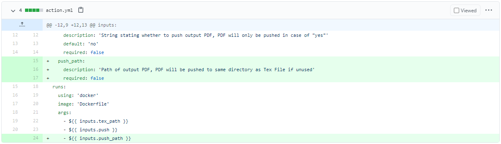
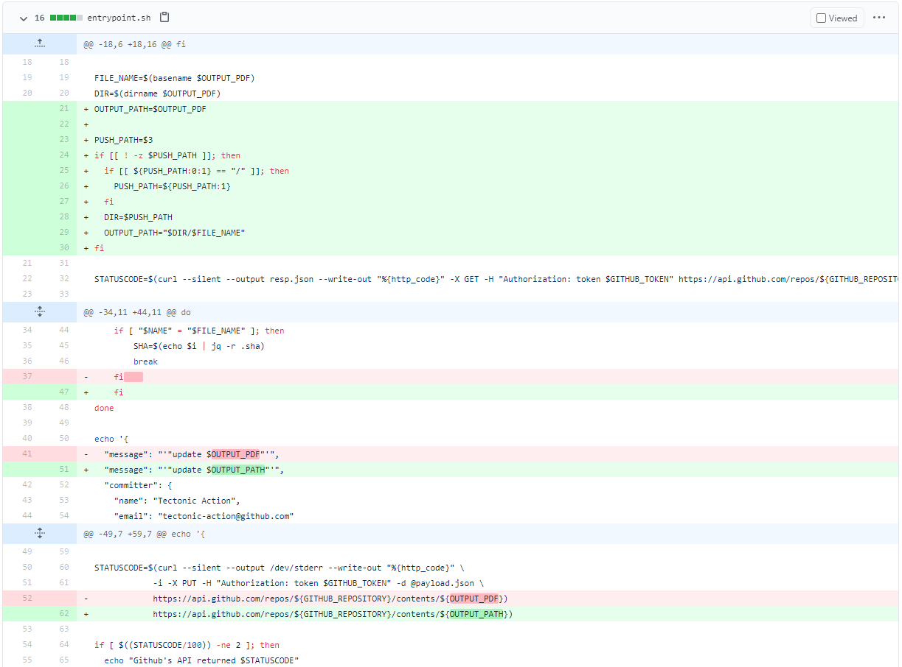
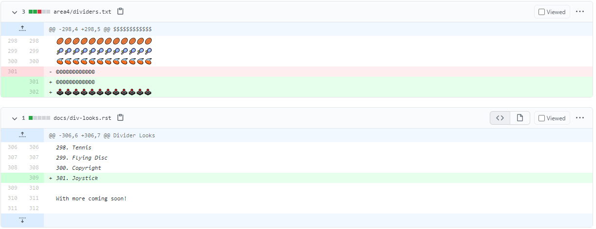

I’d been wanting to contribute to Open Source for a while now but didn’t know where to start. It felt daunting to get up to speed with a strangers project, and then have your work critiqued by a stranger. However, this year I challenged myself to complete Hacktoberfest and thought I’d share; what I’d learnt from the Pull Requests I submitted, how I found GitHub Issues to work on, and my overall experience with Hacktoberfest and contributing to Open Source.
So you’ve done the ‘first contributions’ tutorial where you add your name to a repo after creating a PR from your forked repo, or you’ve contributed documentation to a repository. Now what?
There are a few tools that aggregate issues and allow you to search for them based off of topic, for example [Gauger](https://gauger.io/contrib/) and [Good First Issue](https://goodfirstissue.dev/).
The “[Hacktoberfest](https://github.com/topics/hacktoberfest)” topic on GitHub is good to search for repositories to contribute to as well — I also like to search through topics I have an interest in, such as [GitHub Actions](https://github.com/topics/continuous-integration).

## These are the Pull Requests I submitted for Hacktoberfest
# 1st PR — [webi-installers](https://github.com/webinstall/webi-installers) — Adding a new package GoReleaser
[Issue](https://github.com/webinstall/webi-installers/issues/122) and [Pull Request](https://github.com/webinstall/webi-installers/pull/140)

Webi allows you to install tools (like Node, GO and PostgreSQL) with just a curl command! I found an issue asking for a developer to add GoReleaser as a package to Webi. The documentation on how to add a new package/tool to Webi was fantastic and even included a video on how to do this.
I started from the example templates with this command `rsync -av _example/ goreleaser/` and then made the changes that were specific for the GoReleaser package.
I could not have found a better first issue and repo to contribute to as a complete Open Source beginner.

# 2nd PR — [Gwion](https://github.com/Gwion/Gwion) — Benchmark action should respect [skip ci]
[Issue](https://github.com/Gwion/Gwion/issues/209) and [Pull Request](https://github.com/Gwion/Gwion/pull/212)

In this issue, the task was to add a bash command in a run step for a GitHub action to exit if `skip ci` is in the commit message, preventing the next bash commands from running.
There was already a suggestion of what this command might look like:
```
[ -z $(git log -n1 --oneline --grep='[skip ci]' ] && exit 0
```
I fired up my terminal and played around until I ended up with the following:
```
[ ! -z "$(git log -n1 --oneline --grep='skip ci')" ] && exit 0
```
The git log command will output the whole commit message if `skip ci` is in it. The `z` argument will return false if a string is not empty, which is why we need to use the `!` operator as we want `true` when a git commit contains `skip ci` and will then exit.

# 3rd PR — [LaTeX GitHub Action](https://github.com/vinay0410/tectonic-action) — new feature
[Issue](https://github.com/vinay0410/tectonic-action/issues/7) and [Pull Request](https://github.com/vinay0410/tectonic-action/pull/8)

This is the most work I put into my Hacktoberfest PRs, and ironically it wasn’t accepted in time. I didn’t mind too much since I learnt a lot more about GitHub actions from working on this repo and how to commit a file back to a repo within an action which is useful to do sometimes.
This is a reality of Open Source, maintainers have lives too and might not be able to review your PR in a timely manner — so be patient!

I added a new, optional input to the `action.yml` file called `push_path` and then added this as an argument to the action.



I then altered the bash script that this action executes, `entrypoint.sh`
I set the variable `PUSH_PATH` to the third argument (`inputs.push_path`). if it was not empty, I remove a trailing forward if need be and set the `DIR` variable to this and `OUTPUT_PATH` to a concatenation of `DIR` and `FILE_NAME`.



# 4th PR — [action-conflict-finder](https://github.com/olivernybroe/action-conflict-finder) — Change to alpine image
[Issue](https://github.com/olivernybroe/action-conflict-finder/issues/1) and [Pull Request](https://github.com/olivernybroe/action-conflict-finder/pull/4)

This was another GitHub Action repo with a quick issue to fix. I just needed to change the base Docker image from Ubuntu to Alpine.
I changed the image from `ubuntu:latest` to `alpine:3.12.0` , selecting a static version is usually better than `latest` because a new Docker image could introduce a breaking change 😱. After testing this, I found there were problems with with Grep because the default version on Alpine doesn’t support the `R` flag. This was fixed by installing grep with `RUN apk add grep`.

# 5th PR — [area4](https://github.com/area4lib/area4) — Hacktoberfest 2020
[Issue](https://github.com/area4lib/area4/issues/297) and [Pull Request](https://github.com/area4lib/area4/pull/311)

This is a Python package that includes a bunch of ‘dividers’ that you can easily print in your logging messages.
The issue I worked on was to add a new divider of your choosing. I added a divider made up of the joystick emoji🕹️.



I don’t recommend working on issues like these, as it feels like you are not really contributing anything and I wouldn’t blame the Hacktoberfest moderators if they didn’t approve this. You also aren’t learning anything and to me it feels like it goes against the spirit of Hacktoberfest.
However, I needed a back up PR in case my 3rd PR was not accepted in time, and I was interested to see if this would count to my 4 PRs.
(There are a lot of repos that open issues that will accept virtually any contribution in the sole purpose of helping developers reach their goal of 4 PRs).

# 6th PR — [automated-artillery-action](https://github.com/SenorGrande/automated-artillery-action)
[Pull Request](https://github.com/SenorGrande/automated-artillery-action/pull/1)

I’ve been working on a GitHub Action to automate [Artillery](https://artillery.io/) load tests (blog post about it coming soon!). I wanted to see if contributing to my own PR would count towards my Hacktoberfest PR count as a backup to my backup PR — spoiler, it did!

I added the ‘Hacktoberfest’ label to the repository, opened a PR to merge code from a develop branch into the master branch (No forking required), and merged it all in.

I learnt a lot from Hacktoberfest and definitely recommend trying it out for yourself, or contributing to Open Source any time of the year. I’m proud to say I’ve finally completed one after years of wanting to and can’t wait to receive my T-shirt.
Play to your strengths — I worked on GitHub actions, and issues that needed CI changes because I’ve done a lot in the past with Circle CI, Travis CI, and GitHub Actions. CI can also be similar between projects, which reduces the time required to onboard yourself on a previously unknown code base.
Also look at the repos that you use regularly since you’ll probably have some understanding of how they work

Now go forth and contribute to Open Source! Thanks for reading 🤙
