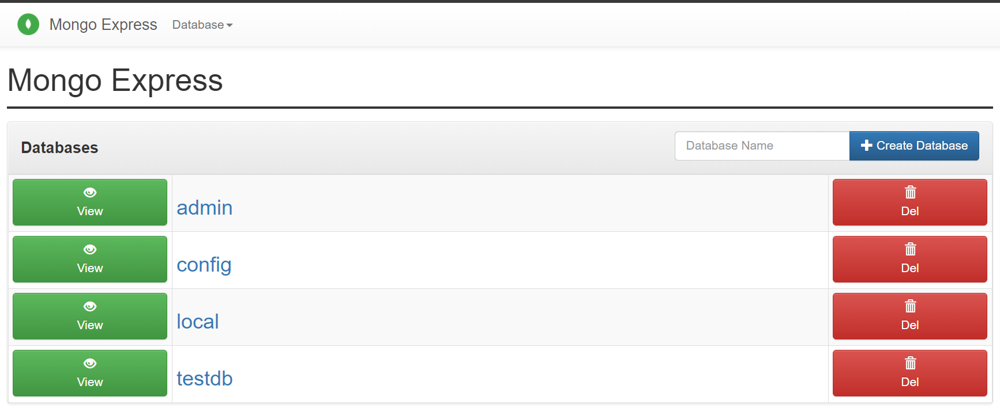

Here’s how to create a quick MongoDB Docker container with a volume to store the Database. We will also create a simple “init” script to create a user, then create a collection and insert a ‘document’ into that collection.

We’ll create a quick `Dockerfile` so that our Mongo container isn’t running as root (although feel free to use a Mongo image), a `docker-compose.yml` file to create the our containers and volume for our database as well as passing environment variables to create a user and password, and an `init-mongo.js` script that Mongo will use on first start up to run some Mongo commands.

## Dockerfile
It is best to not run a container as root, so this Dockerfile will use the official Mongo image and change the user to the mongodb Linux user.
Feel free to just use the Mongo image in the Docker Compose script if you are just testing, but for production, it is best to not let containers use a root user.
```
FROM mongo:4.4.1
USER mongodb
```

## init-mongo.js
This script will run when the container starts up, and will create a new user with read & write access to a MongoDB database called ‘testdb’.
A collection will then be created in this DB called ‘users’ (This is because in the following Docker Compose script, ‘testdb’ is set as the initial database).
A record is then inserted into the collection that was just created.
```
db.createUser(
  {
    user: "bpalmer",
    pwd: "password",
    roles: [
      {
        role: "readWrite",
        db: "testdb"
      }
    ]
  }
};
db.createCollection('users');
db.users.insertOne(
  {
    name: 'Bill Palmer'
  }
);
```

## docker-compose.yml
The `mongo` service will:
- Create a root Mongo user called `root` with `example` as the password
- Create a database called `testdb`
- Mount the ‘init’ script to the `/docker-entrypoint-initdb.d` directory as ‘read only’
- Attach a Docker volume to `/data/db` where Mongo stores the db files

The `mongo-express` service provides a useful web app to access the MongoDB databases in the `mongo` container and will:
- Publish port 8081 of the container to the host machine — This allows us to access Mongo Express at `http://localhost:8081`
- Set the admin credentials to use so that it can connect to the MongoDB database
```
version: '3.1'
services:
  mongo:
    build: . # Instead of build you can use 'image: mongo'
    restart: always
    environment:
      MONGO_INITDB_ROOT_USERNAME: root
      MONGO_INITDB_ROOT_PASSWORD: example
      MONGO_INITDB_DATABASE: testdb
    volumes:
      - ./mongo-init.js:/docker-entrypoint-initdb.d/mongo-init.js:ro
      - mongo-volume:/data/db
  mongo-express:
    image: mongo-express
    restart: always
    ports:
      - 8081:8081
    environment:
      ME_CONFIG_MONGODB_ADMINUSERNAME: root
      ME_CONFIG_MONGODB_ADMINPASSWORD: example
volumes:
  mongo-volume
```



## Useful Docker commands
Here’s how to create a shell in the Mongo container and use the Mongo CLI — this can be useful for debugging.
```
$ docker exec -it mongodb_test_mongo_1 mongo
> use admin
> db.auth('username', 'password') 
# e.g. with the DB we created above
> use testdb
> db.auth('bpalmer', 'password')
```
I hope this helped you get up and running with MongoDB!
Chur 🤙