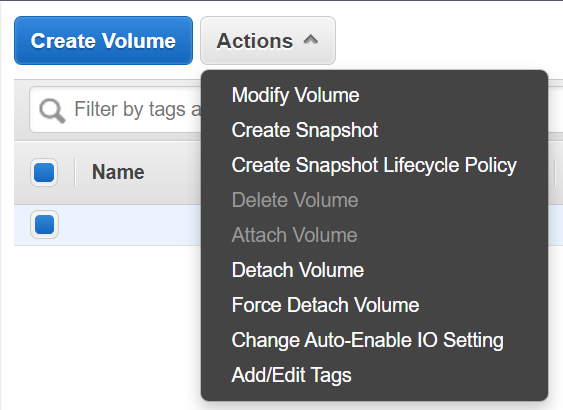
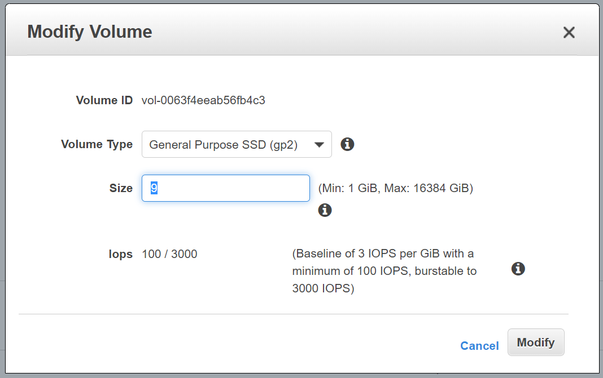

Sometimes I find that an EC2 runs out of disk space because Linux Kernel header files aren’t being purged from `/usr/src` — this can be a pain because you have no space left to be able to run the commands to remove them!
Here’s how to increase the size of your EC2 volume an purge the header files.
SSH into your AWS EC2 instance and check diskspace and partition sizes:

```
$ df
$ lsblk
```

### Increase the volume size in the AWS console
Under EC2, select “Volumes” in the side panel. Select the volume you want to enlarge and click “Actions” and then “Modify Volume”.



Enter a larger number than what is in the “Size” input box. I changed mine from 8GB to 9GB as I only need 1GB to be able to purge all the Linux header files. *NOTE:* At this point you can reboot the instance for the new volume size to take effect, but if that doesn’t work, or you can’t have downtime for this instance, carry on reading.



### Resize the disk to take advantage of the increased EC2 volume size
Check the diskspace and partition size again, `df` should be the same output but `lsblk` should show the root partition being larger now.

Mount a temporary file system. This allows us enough space to increase the partition size.

```
$ sudo mount -o size=10M,rw,nodev,nosuid -t tmpfs tmpfs /tmp
```

Expand the partition size

```
$ sudo growpart /dev/xvda 1
```

Check the partition has expanded with `lsblk` and then resize the filesystem to use the extra space of this expanded partition.

```
$ sudo resize2fs /dev/xvda1
```

Check that `/dev/xvda1` is no longer full by runningdf again.

Now remove those old Linux header files with the following commands:

```
$ sudo apt -f install
$ sudo apt --purge autoremove
```

I hope this helped! Chur 🤙