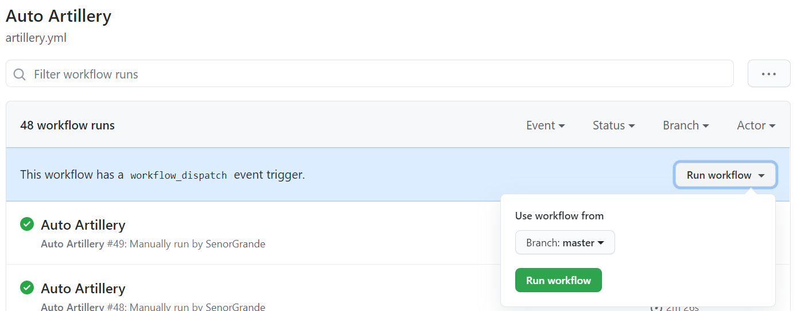
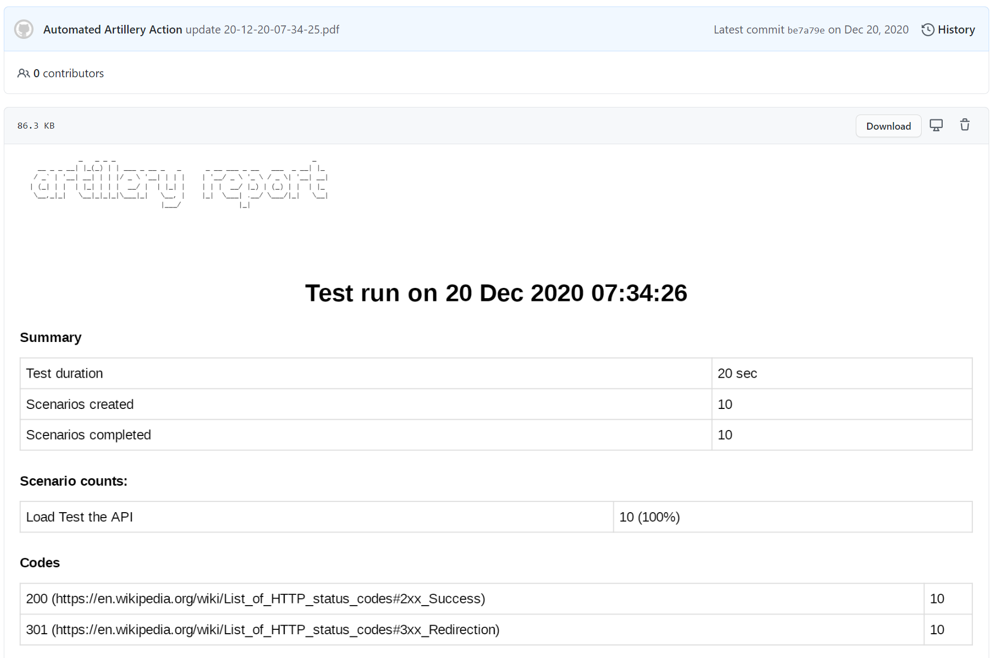

[Artillery](https://artillery.io/) is a Node package that can be used to create simulated load tests. You can define steps and APIs to send requests to, as well as create randomized data to simulate users.
I wanted a way to automate running load tests, as well as creating reports that can be made with Artillery — for this, I turned to GitHub Actions.

[Source code for this project](https://github.com/marketplace/actions/automated-artillery-action)

# GitHub Action
This GitHub action will run an Artillery load test, generate an HTML report, convert it to PDF, and commit it back to the GitHub repo the action is running on.

## Dockerfile
I used the official Node version 14 image and update/install some packages to set up Chrome in advance of Puppeteer.
Artillery is installed globally so that the `artillery` command works in the `entrypoint.sh` script and install Puppeteer locally for the checked out Git repo that this Action is used on.

```
# Node Alpine container image
FROM node:14.14.0

RUN  apt-get update \
     && apt-get install -y wget gnupg ca-certificates jq \
     && wget -q -O - https://dl-ssl.google.com/linux/linux_signing_key.pub | apt-key add - \
     && sh -c 'echo "deb [arch=amd64] http://dl.google.com/linux/chrome/deb/ stable main" >> /etc/apt/sources.list.d/google.list' \
     && apt-get update \
     # We install Chrome to get all the OS level dependencies, but Chrome itself
     # is not actually used as it's packaged in the node puppeteer library.
     # Alternatively, we could could include the entire dep list ourselves
     # (https://github.com/puppeteer/puppeteer/blob/master/docs/troubleshooting.md#chrome-headless-doesnt-launch-on-unix)
     # but that seems too easy to get out of date.
     && apt-get install -y google-chrome-stable \
     && rm -rf /var/lib/apt/lists/* \
     && wget --quiet https://raw.githubusercontent.com/vishnubob/wait-for-it/master/wait-for-it.sh -O /usr/sbin/wait-for-it.sh \
     && chmod +x /usr/sbin/wait-for-it.sh

# Install artillery globally
RUN npm i -g artillery --allow-root --unsafe-perm=true
RUN npm i puppeteer

# Copy bash script to root of container image
COPY entrypoint.sh /entrypoint.sh
COPY generate-pdf.js /generate-pdf.js

RUN chmod +x /entrypoint.sh

# Execute Bash script on container start up
ENTRYPOINT ["/entrypoint.sh"]
```

## action.yml
The GitHub Action YAML file defines two input arguments:
- artillery_path: Required argument for path and file name for the Artillery YAML file in the repo this Action is being used on. This is so the Action can run the Load Test.
- output_path: Optional argument that defines path to save the report file. If undefined, report will be saved to the root of the directory

```
name: 'Automated Artillery Action'
description: 'Automate Artillery Load Tests'
branding:
  icon: crosshair
  color: red
inputs:
  artillery_path:
    description: 'Path of Artillery YAML File'
    required: true
  output_path:
    description: 'Path to push reports to'
    required: false
runs:
  using: 'docker'
  image: 'Dockerfile'
  args:
    - ${{ inputs.artillery_path }}
    - ${{ inputs.output_path }}
```

## entrypoint bash script
generating report and committing back to the repo
This script is used as the entry point for the Docker container and will execute once the container has spun up.

* The script will run the artillery load test, writing the results to report.json
* The artillery report command is then used to generate an HTML report form the .json file
* The generate-pdf.js script is called to convert the HTML file to PDF using Puppeteer
* The PDF file is then committed to the repo using the GitHub token that is set as a secret.

```
#!/usr/bin/env bash

set -e
echo "Running Load Test"

# $1 is the path of the Load Test
# $2 is the output path for reports

artillery run --output report.json $1

OUTPUT_PDF=$(date +"%y-%m-%d-%H-%M-%S").pdf
OUTPUT_PATH=$OUTPUT_PDF

PUSH_PATH=$2
if [[ ! -z $PUSH_PATH ]]; then
  if [[ ${PUSH_PATH:0:1} == "/" ]]; then
    PUSH_PATH=${PUSH_PATH:1}
  fi
  OUTPUT_PATH="$PUSH_PATH/$OUTPUT_PDF"
fi

artillery report --output report.html report.json
node /generate-pdf.js
mv report.pdf $OUTPUT_PDF

STATUSCODE=$(curl --silent --output resp.json --write-out "%{http_code}" -X GET -H "Authorization: token $GITHUB_TOKEN" https://api.github.com/repos/${GITHUB_REPOSITORY}/contents/$DIR)

if [ $((STATUSCODE/100)) -ne 2 ]; then
  echo "Github's API returned $STATUSCODE"
  cat resp.json
  exit 22;
fi

SHA=""
for i in $(jq -c '.[]' resp.json);
do
    NAME=$(echo $i | jq -r .name)
    if [ "$NAME" = "$OUTPUT_PDF" ]; then
        SHA=$(echo $i | jq -r .sha)
        break
    fi    
done

echo '{
  "message": "'"update $OUTPUT_PDF"'",
  "committer": {
    "name": "Automated Artillery Action",
    "email": "automated-artillery-action@github.com"
  },
  "content": "'"$(base64 -w 0 $OUTPUT_PDF)"'",
  "sha": "'$SHA'"
}' > payload.json

STATUSCODE=$(curl --silent --output /dev/stderr --write-out "%{http_code}" \
            -i -X PUT -H "Authorization: token $GITHUB_TOKEN" -d @payload.json \
            https://api.github.com/repos/${GITHUB_REPOSITORY}/contents/${OUTPUT_PATH})

if [ $((STATUSCODE/100)) -ne 2 ]; then
  echo "Github's API returned $STATUSCODE"
  exit 22;
fi
```

## puppeteer script
This script is executed by the `entrypoint.sh` script above and uses the Puppeteer NPM package to launch a headless Chrome process, open the Artillery HTML report and convert it to PDF. This PDF file is saved to the filesystem.

```
const puppeteer = require('puppeteer');

(async () => {
    const browser = await puppeteer.launch({args: ['--no-sandbox', '--disable-setuid-sandbox']});
    const page = await browser.newPage();
    await page.goto('file:///github/workspace/report.html', {waitUntil: 'networkidle2'});
    await page.pdf({path: 'report.pdf', format: 'A4'});

    await browser.close();
})();
```

## How to use this Action in your own repo
Create a GitHub access token on your account that has permissions to read and write to repos, this will be used by the action to commit the report to the repo. Create a secret on the repo called `TOKEN` and set the value to the GitHub access token you just created.

```
name: Auto Artillery
on: [workflow_dispatch]

jobs:
  artillery-job:
    runs-on: ubuntu-latest
    name: Run Load Test
    steps:
    - uses: actions/checkout@v1
    - name: Artillery
      uses: SenorGrande/automated-artillery-action@v1.0.0
      env:
        GITHUB_TOKEN: ${{ secrets.TOKEN }}
      with:
        artillery_path: 'index.yml'
        output_path: 'reports'
```

note: `on: [workflow_dispatch]` means the action can be run manually.



You can then view these reports within GitHub by browsing through the repo and clicking on the file!



Thanks for reading!
Choice 🤙
