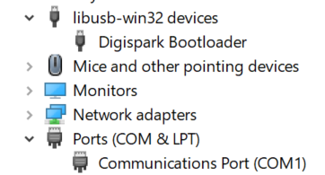

This article will run through how to get started with programming a DigiSpark microcontroller and upload a script to control some WS2812 LEDs using the NeoPixel library.
Assuming you already have the Arduino IDE installed, [you will need to add the Digispark boards as an option to the IDE](https://digistump.com/wiki/digispark/tutorials/connecting) by following the steps below.

Select `File` > `Preferences` to open up the `Preferences` window.


Add `http://digistump.com/package_digistump_index.json` to Additional Boards Manager URLs (If you already have a URL there, add a comma at the end before pasting the digitstump URL).


Now to add the Digitstump boards to Arduino, search for and install *Digistump AVR Boards* by *Digistump* in the Boards Manager (Tools > Board: “Selected Board” > Boards Manager) and click install.
*NOTE*: This should install the Adafruit Neopixel library that we will use to control WS2812 LEDs.


Once installed, make sure that “Digispark (Default 16.5mhz)” is your selected board by checking it at Tools > Board > Digistump AVR Boards > Digispark (Default 16.5mhz).
You should now be ready to upload a script to your Digispark.

## Upload Example Script
Here’s an example script that will slowly cycle through the colours of the rainbow on a strip of 3 LEDs.
I have a strip of 3 WS2812B for testing, with the data pin connected to Pin 1 of the Digispark module. Since there is only 3 LEDs, it is safe to power the strip through the Digispark’s 5v and GND pins, but for strips with more LEDs (I have read over 30, but have yet to test) you will need to power the LED strip separately.

Create a new project and paste the script below…

```
#include <Adafruit_NeoPixel.h>
#define PIN 1
#define STRIPSIZE 3 // Limited by max 256 bytes ram. At 3 bytes/LED you get max ~85 pixels
Adafruit_NeoPixel strip = Adafruit_NeoPixel(STRIPSIZE, PIN, NEO_GRB + NEO_KHZ800);
void setup() {
  strip.begin();
  strip.setBrightness(100); // set accordingly
  strip.show(); // Initialize all pixels to 'off'
}
void loop() {
  rainbow(1000);  
}
// Fill the dots one after the other with a color
void colorWipe(uint32_t c, uint8_t wait) {
  for(uint16_t i=0; i<strip.numPixels(); i++) {
      strip.setPixelColor(i, c);
      strip.show();
      delay(wait);
  }
}
void rainbow(uint8_t wait) {
  uint16_t i, j;
for(j=0; j<256; j++) {
    for(i=0; i<strip.numPixels(); i++) {
      strip.setPixelColor(i, Wheel((i+j) & 255));
    }
    strip.show();
    delay(60000L);
  }
}
// Input a value 0 to 255 to get a color value.
// The colours are a transition r - g - b - back to r.
uint32_t Wheel(byte WheelPos) {
  if(WheelPos < 85) {
   return strip.Color(WheelPos * 3, 255 - WheelPos * 3, 0);
  } else if(WheelPos < 170) {
   WheelPos -= 85;
   return strip.Color(255 - WheelPos * 3, 0, WheelPos * 3);
  } else {
   WheelPos -= 170;
   return strip.Color(0, WheelPos * 3, 255 - WheelPos * 3);
  }
}
```

Click “Upload” in the Arduino IDE.
Once the IDE has finished compiling, you will be prompted to plug the Digispark microcontroller in (this is a bit different to regular Arduino microcontrollers where you need to select the board and COM port first)


Once you have plugged in your Digispark (or unplugged and replugged), it will start to upload to the module!


Bonza! You’re done 🚀
(If you found that the Arduino IDE could not recognize the Digispark device, you might need to follow the below steps)

## Optional: Install Drivers for Windows 10
[I found that I needed to install drivers on Windows 10 and found this link helpful](https://startingelectronics.org/tutorials/arduino/digispark/digispark-windows-setup/), I’ve outlined the same steps below:

Download the Drivers from [Digistump’s GitHub](https://github.com/digistump/DigistumpArduino/releases/download/1.6.7/Digistump.Drivers.zip)

Unzip the folder and open `DPinst.exe` if you are on a 32-bit Windows 10 system or `DPinst64.exe` if you are on a 64-bit Windows 10 system. Follow the prompts to install the drivers.




I found that under Device Manager, the Digispark device showed up as “Digispark Bootloader” under “libusb-win32 devices” after installing the drivers and the Arduino IDE could then recognize my Digispark.

Cheers!