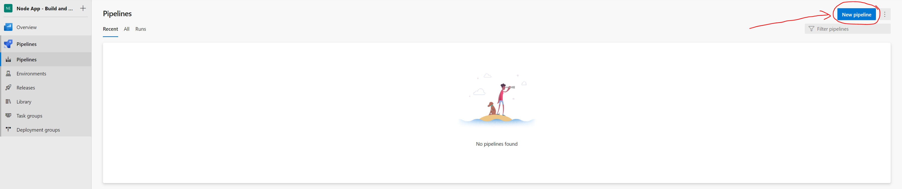

## YAML for pipeline
**.azure/azure-pipelines.yml**

This file is our main pipeline and only triggers on the master branch.
It uses the `templates/build.yml` file as a template and will use the stages defined in that file.

```
trigger:  
  branches:    
    include:      
      - master
pr: none
stages:
- template: templates/build.yml
```

**.azure/templates/build.yml**

This template defines a stage that consists of a single job made up of two steps. The first task will essentially run a `docker build` to create our image with a Dockerfile in the root directory of our repo and tagging it with the name defined in the variable `DOCKER_REPOSITORY_NAME` and with a version equal to the pipeline build ID `$(Build.BuildId)`.
The second task will push this image to ECR

```
stages:
- stage: Docker
  displayName: Build & Push Docker image to AWS ECR
  jobs:
  - job: Build_and_Push
    displayName: Build & Push Docker image
    pool:
      vmImage: ubuntu-latest
    steps:
    - task: Docker@2
      displayName: Build an image
      inputs:
        command: build
        dockerfile: '$(Build.SourcesDirectory)/Dockerfile'
        buildContext: '$(Build.SourcesDirectory)'
        repository: $(DOCKER_REPOSITORY_NAME)

    - task: ECRPushImage@1
      inputs:
        awsCredentials: 'AWS_ECR'
        regionName: $(AWS_REGION)
        imageSource: 'imagename'
        sourceImageName: $(DOCKER_REPOSITORY_NAME)
        sourceImageTag: $(Build.BuildId)
        pushTag: latest
        repositoryName: $(DOCKER_REPOSITORY_NAME)
```

Commit and push these files to your repo’s master branch, and we will create the pipeline in Azure DevOps.

## Create a project and pipeline in Azure DevOps
Create a new project in Azure Devops. Once created and in the project, click on “Pipelines” and then “new pipeline”.



After clicking “new pipeline”, select GitHub and then choose your repo you would like to create your pipeline for.

In the third step, “Configure your pipeline”, select “Existing Azure Pipelines YAML file”.


Then choose the branch and path for the Azure Pipelines YAML file that you created in the previous step. (Master branch, and ./azure/azure-pipelines.yml)

## AWS — IAM user and ECR repo
We will need to setup and IAM user with Access Credentials that Azure DevOps can use to authenticate to ECR and an ECR repo that the pipeline can push images to.


## Create AWS service connection
You will need to install the AWS Toolkit into your Azure DevOps Account https://marketplace.visualstudio.com/azuredevops

Once installed, go into “project settings” (Gear icon in the bottom left corner) and “Service Connections”. Then select “AWS”, stick in your Access Key and Secret Access Key of your IAM user that has Full ECR access. I named my connection “aws_ecr” which is used in the `awsCredentials` input for the `ECRPushImage` task. (note: this doesn’t seem to be case sensitive, I named it “aws_ecr” in the project service connection, but in the YAML file referred to it as `AWS_ECR`).

## Setup environment variables
Edit your pipeline, which will bring up the YAML script, then click on “variables”.

Add DOCKER_REPOSITORY_NAME with the name of your ECR repo, node_app in my instance.

Add AWS_REGION that you are using, I am using ap-southeast-2 for the Sydney region.


## Run the Pipeline
If you’re in the pipeline in the Azure DevOps dashboard, you can manually trigger a run by clicking the blue “Run Pipeline” button, otherwise pushing a commit to the master branch will also trigger it.


Bonza 👌 — Hope this helped you.
