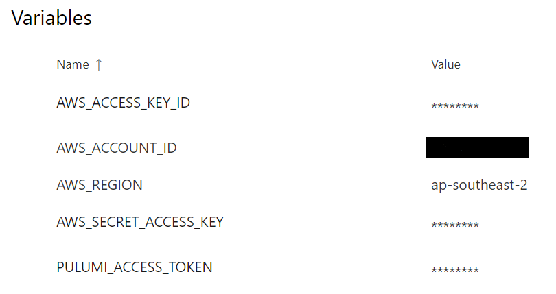

In Part 1, we created a Pulumi project to create and AWS ECR repository and then build and push a Docker image to the newly created repo. In this sequel, we will create an Azure DevOps Pipeline to automate the CI process for us.

In Part 3, we will add Semantic Release to automate versioning of the image with each run of the pipeline, as this pipeline will only tag the Docker image with the hard-coded version defined in the repo.

[Source Code](https://github.com/SenorGrande/pulumi_ecr_example)

## Create the YAML for the pipeline
Create a folder called `.azure` in the repo we created in “Part 1” with a file named `build.yml` with the following code.
Important things to note about this pipeline:
- This pipeline will only trigger on commits to the `main` branch
- It pulls in a library called `Build`

When the pipeline runs it will:
- Install Node.js 12.20.1
- Install NPM packages in the root directory of the repo (dependencies for the Pulumi project
- Install NPM packages in the `app` directory (dependencies for the Node.js app that will be built into a Docker image)
- Build the Node.js app in the `app` directory
- Login to Pulumi (with an access token from the `Build` library)
- Select the Pulumi stack in our Pulumi account to use (and create it if it doesn’t already exist)
- Login to AWS ECR so that an image can be pushed to the repo (using the AWS credentials in the `build` library)
- Run `pulumi up` to create an ECR repository if it doesn’t already exist, then build and push a Docker image to it.

```
# Trigger on any push to main
trigger:
  - main

pr: none

pool:
  vmImage: ubuntu-20.04

variables:
- group: "Build"

stages:
  - stage: Build
    displayName: Build and push ECR image
    jobs:
      - job: Pulumi
        steps:
        - task: NodeTool@0
          inputs:
            versionSpec: 12.20.1
          displayName: 'Install Node.js version 12.20.1'
        - task: Bash@3
          name: npmInstall
          displayName: NPM Install
          inputs:
              targetType: 'inline'
              script: npm i
        - task: Bash@3
          name: npmInstallApp
          displayName: NPM Install App Dependencies
          inputs:
              workingDirectory: $(Build.SourcesDirectory)/app
              targetType: 'inline'
              script: npm i
        - task: Bash@3
          name: npmBuild
          displayName: NPM Build
          inputs:
              workingDirectory: $(Build.SourcesDirectory)/app
              targetType: 'inline'
              script: npm run build
        - task: Bash@3
          name: pulumiLogin
          displayName: Pulumi Login
          inputs:
              targetType: 'inline'
              script: pulumi login
          env:
            PULUMI_ACCESS_TOKEN: $(PULUMI_ACCESS_TOKEN)
        - task: Bash@3
          name: pulumiStackSelect
          displayName: Pulumi Stack Select
          inputs:
              targetType: 'inline'
              script: pulumi stack select dev -c --non-interactive
        - task: Bash@3
          displayName: 'Login to AWS'
          inputs: 
            targetType: 'inline'
            script: aws ecr get-login-password --region $(AWS_REGION) | docker login --username AWS --password-stdin $(AWS_ACCOUNT_ID).dkr.ecr.$(AWS_REGION).amazonaws.com
          env:
            AWS_ACCESS_KEY_ID: $(AWS_ACCESS_KEY_ID)
            AWS_SECRET_ACCESS_KEY: $(AWS_SECRET_ACCESS_KEY)
        - task: Bash@3
          name: pulumiUp
          displayName: Pulumi Up
          inputs:
              targetType: 'inline'
              script: pulumi up -y
          env:
            AWS_ACCESS_KEY_ID: $(AWS_ACCESS_KEY_ID)
            AWS_SECRET_ACCESS_KEY: $(AWS_SECRET_ACCESS_KEY)
```

## Create a project and pipeline in Azure DevOps
Create a new project in Azure Devops. Once created and in the project, click on “Pipelines” and then “new pipeline”.


After clicking “new pipeline”, select GitHub and then choose your repo you would like to create your pipeline for.

In the third step, “Configure your pipeline”, select “Existing Azure Pipelines YAML file”.


Then choose the branch and path for the Azure Pipelines YAML file that you created in the previous step. ( `main` branch and `./azure/build.yml` in my case).

## Create Library “Build”
On the left-hand navigation bar in Azure DevOps, select “Library” in the “Pipelines” group and click on “+Variable Group”. Type in “Build” for the “Variable Group Name” (you can name it something else, but remember to change that name in the `build.yml` file where you pull in the variable group).

Add the following variables to your variable group:

- AWS_ACCESS_KEY_ID — The access key of the IAM creds that have access to ECR
- AWS_ACCOUNT_ID — The ID of your AWS account you’re deploying this to, I’ve censored mine for the sake of this article, but doesn’t need to be marked secret
- AWS_REGION — AWS region to create the ECR repo in, I’ve chosen Sydney
- AWS_SECRET_ACCESS_KEY — The secret key of the IAM creds that have access to ECR
- PULUMI_ACCESS_TOKEN — Access token created in your Pulumi account (check “Settings” > “Access Tokens” to create one)



## Run the Pipeline
Run the pipeline manually or push a new commit to the main branch to trigger a run.


This will push an image with the version hard-coded in the repo (Pulumi will also add a second tag with a unique string appended to the original tag string). Subsequent runs of the pipeline will result in only the latest image having the hard-coded tag (in this case `v1.0.2`). We will make this dynamic in “Part 3” of this series, so stay tuned!


Hoped this helped,
Bonza 🤙