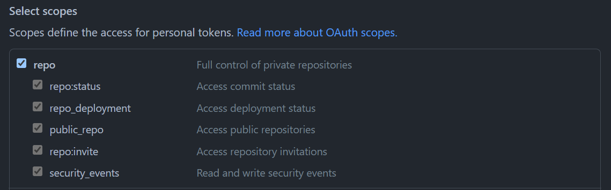
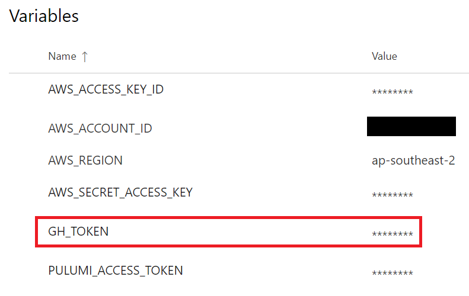
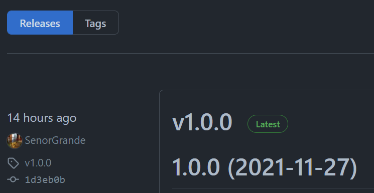

In this last part of the series, we will add Semantic Release to our project and pipeline to automate versioning the Docker images the pipeline builds and pushes to AWS ECR.

[Here’s the code to project if you’d like to view the code](https://github.com/SenorGrande/pulumi_ecr_example)

## Add a GitHub Personal Authentication Token to the Azure Library
Generate a GitHub Personal Authentication token with repo permissions by going to “Settings” > “Developer Settings” > “Personal Access Token” and click on “Generate new token”.



Add a new **secret** variable `GH_TOKEN` to the Azure Pipelines Library `Build` that we created in the previous articles. Set the value to the GitHub PAT you just created.



## Update Node.js to 14.17 minimum
[Semantic Release](https://github.com/semantic-release/semantic-release) requires at least version `14.17` of Node.js to run. In the previous articles we used `12.20.1`. This doesn’t need to be updated locally, as you can still install the packages, but there will be some warnings.

Update the first task in the `build.yaml` file to install Node.js `14.17.0`:

```
- task: NodeTool@0
  inputs:
    versionSpec: 14.17.0
  displayName: 'Install Node.js version 14.17.0'
```

## Install Semantic Release
Install the Semantic Release package and plugins.

```
$ npm i -D semantic-release @semantic-release/exec @semantic-release/changelog @semantic-release/github @semantic-release/commit-analyzer @semantic-release/release-notes-generator
```

These packages will be added to the `devDependencies` section in the `package.json` file, e.g.

```
"devDependencies": {
  "@semantic-release/changelog": "^6.0.1",
  "@semantic-release/commit-analyzer": "^9.0.2",
  "@semantic-release/exec": "^6.0.2",
  "@semantic-release/github": "^8.0.2",
  "@semantic-release/release-notes-generator": "^10.0.3",
  "@types/node": "^14",
  "semantic-release": "^18.0.1"
},
```

## Add scripts to package.json
Add the following to the `package.json` in the root directory of the project, i.e. the Pulumi project, not the one in the `app/` folder.

The `"release"` section defines the `main` branch to trigger releases off of and which plugins to include.

The most notable plugin here is the `exec` plugin that will create a file named `nextRelease` with the next version number determined by Semantic Release. This is useful for the pipeline, as we will store the contents of this file in an environment variables to use in multiple tasks during the pipeline’s execution.

```
"scripts": {
  "release:create": "./node_modules/.bin/semantic-release",
  "release:determine-new-version": "./node_modules/.bin/semantic-release --dry-run"
},
"release": {
  "branches": [
    "main"
  ],
  "plugins": [
    "@semantic-release/commit-analyzer",
    "@semantic-release/release-notes-generator",
    [
      "@semantic-release/exec",
      {
        "prepareCmd": "echo ${nextRelease.version} > nextRelease"
      }
    ],
    "@semantic-release/github"
  ]
}
```

## Replace hardcoded Docker image tag
Replace the hardcoded version in `index.ts` with an environment variable so that the tag for the Docker image is dynamic:
```
const imageVersion = "v1.0.2";
```
with:
```
const imageVersion = process.env.VERSION;
```
This now uses an environment variable called `VERSION` during `pulumi up` (the last task run in the pipeline). We will set this environment variable in the next step…

## Run the Semantic Release commands in the Pipeline
Add the following to the `build.yml` file before the `Pulumi Up` task (the last task in the pipeline:

```
- task: Bash@3
  name: prerelease
  displayName: Semantic Pre-Release
  inputs:
    targetType: 'inline'
    script: |
      npm run release:determine-new-version
  env:
    GH_TOKEN: $(GH_TOKEN)

- task: Bash@3
  name: release
  displayName: Semantic Release
  inputs:
    failOnStderr: true
    targetType: 'inline'
    script: |
      npm run release:create
      new_version="$(cat nextRelease)"
      echo "##vso[task.setvariable variable=VERSION]$new_version"
  env:
    GH_TOKEN: $(GH_TOKEN)

# publish nextRelease file containing new version number as artifact for deploy pipeline to use
- publish: nextRelease
  artifact: VERSION
```

**NOTE:** Your commit message or Pull Request title needs to meet Semantic Release guidelines, so remember to start it with `feat:` or `fix:` so that Semantic Release determines that a release should be created.

Commit and push your code to trigger the pipeline and watch Semantic Release create a release and tag in your GitHub repo and Azure Pipelines will also push a Docker image tagged with the same version to AWS ECR!



Hope this helped,
Bonza 🤙