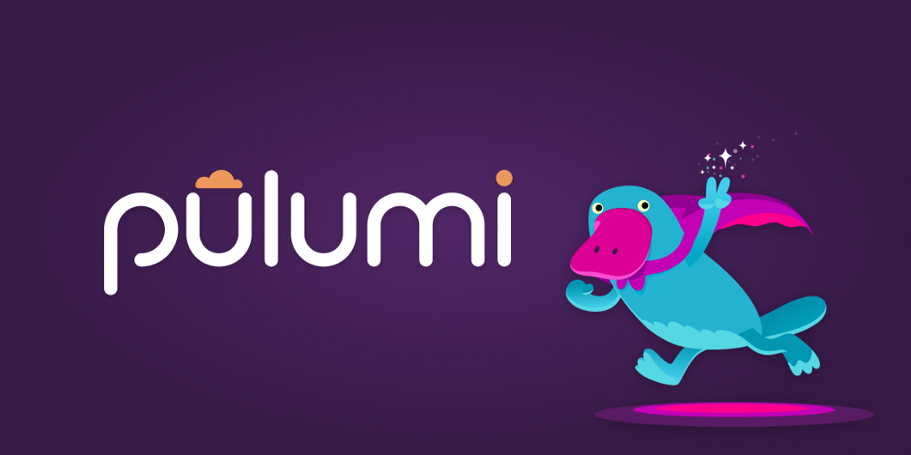
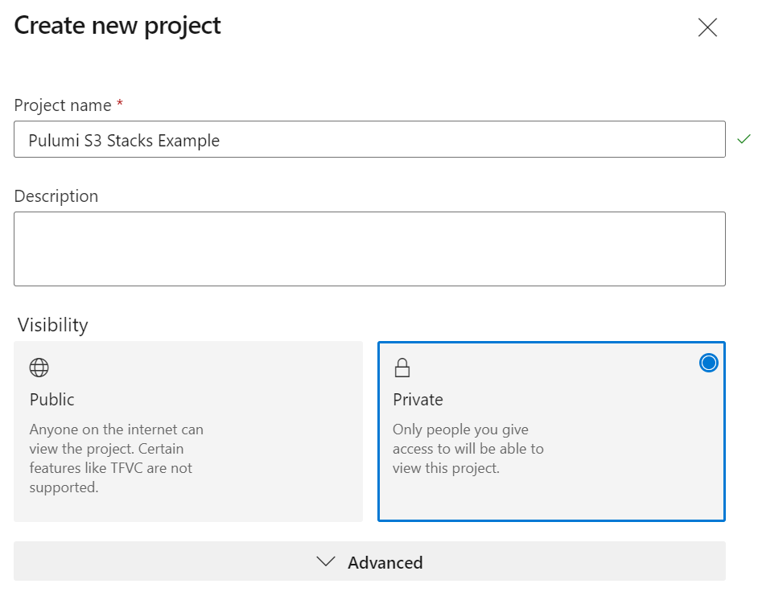
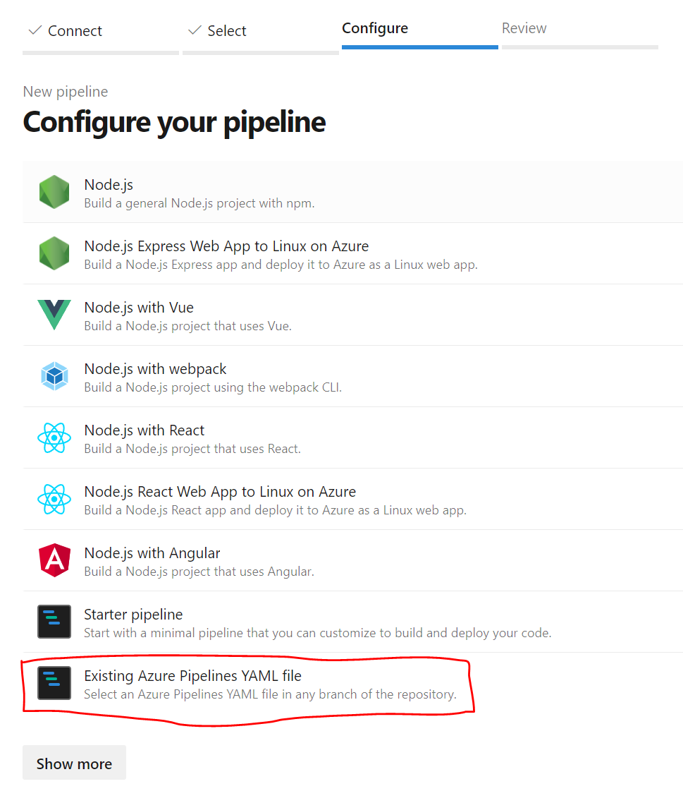
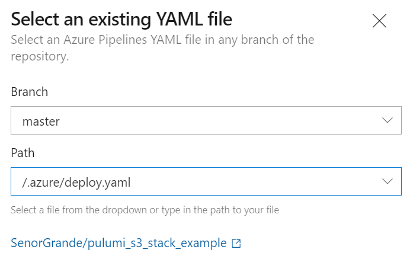
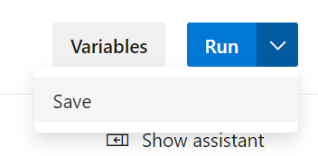
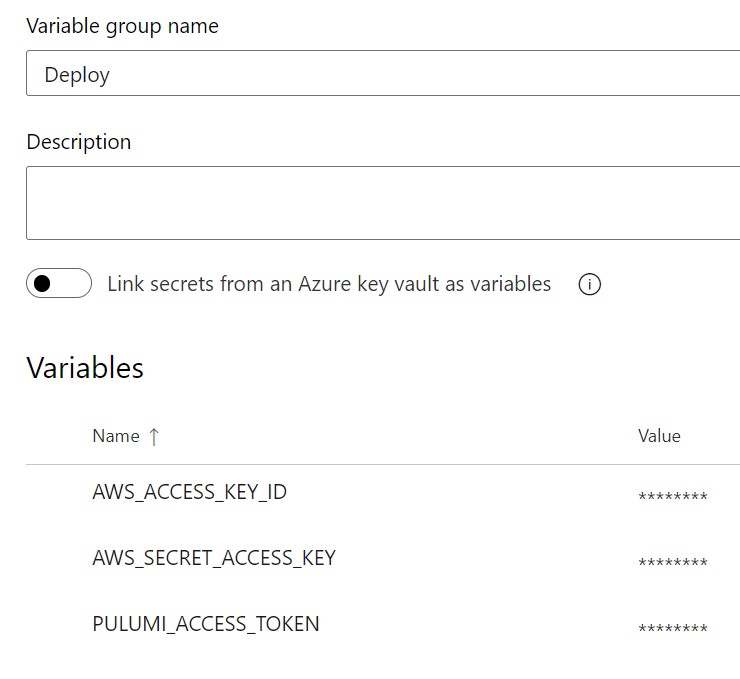
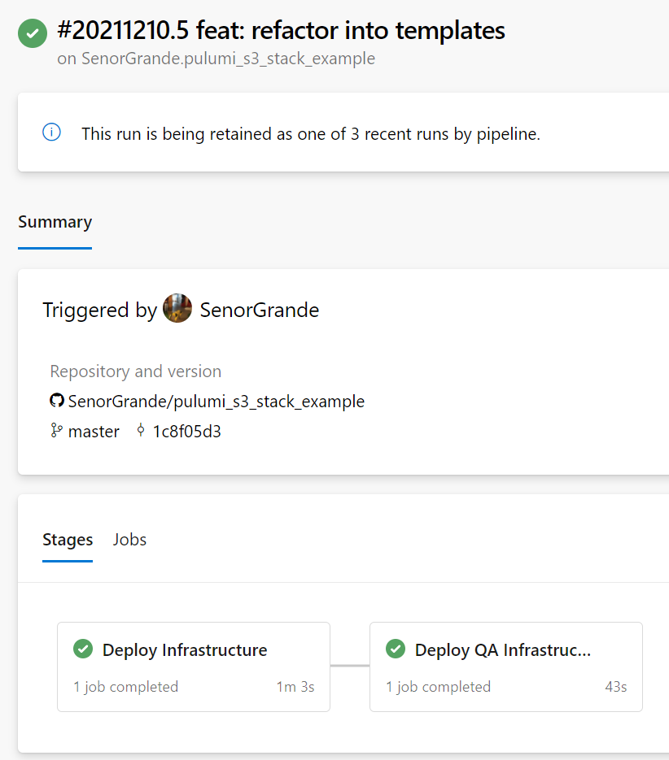
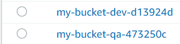

## Create a new github repo
Create a new repo in GitHub (or any other Version Control tool), I named mine `pulumi_s3_stack_example`. I selected the option to create a `README.md` file to make it simple to clone the repo once created.

[Source Code](https://github.com/SenorGrande/pulumi_s3_stack_example)

## Create the Pulumi project
In the terminal and at the path of the cloned project, run `pulumi new aws-typescript --force`. I used force because there is already a `README.md` file existing in the repository and Pulumi doesn’t like creating projects in directories that aren’t empty.

### Edit the index.ts file
replace the boilerplate code with the following:

```
import * as aws from "@pulumi/aws";

const env = process.env.ENVIRONMENT;

// Create an AWS resource (S3 Bucket)
const bucket = new aws.s3.Bucket(`my-bucket-${env}`);

// Export the name of the bucket
export const bucketName = bucket.id;
```

This code (when executed by Pulumi) imports the Pulumi AWS package and then creates an S3 bucket called `my-bucket-[ENVIRONMENT]` where `[ENVIRONMENT]` is replaced with the contents of an environment variable, such as `dev` or `qa`. The name of the bucket is then exported so that it is printed to the console.

**Note:** Pulumi will append the bucket name with a unique identifier.

### Create a Pulumi.qa.yaml file
When we created the Pulumi project, it created a `Pulumi.dev.yaml` by default, create a file for our QA environment called `Pulumi.qa.yaml` and copy the contents of `Pulumi.dev.yaml` into it. Do this for any other environments you want as well.

## Define the Azure Pipeline
Create a directory called `.azure` in the repo and the file `deploy.yaml` and `deploy_template.yaml` in that folder.

Add the following code to `deploy.yaml`:

```
trigger:
  - master

pr: none

pool:
  vmImage: ubuntu-20.04

variables:
- group: "Deploy"

stages:
  - stage: Deploy_Dev
    displayName: Deploy Dev Infrastructure
    jobs:
      - template: deploy_template.yaml
        parameters:
          environment: 'dev'

  - stage: Deploy_Qa
    displayName: Deploy QA Infrastructure
    jobs:
      - template: deploy_template.yaml
        parameters:
          environment: 'qa'
```

This file will be our pipeline and trigger off of commits into master. It grabs the `Deploy` library that we will create in our Azure DevOps project later.

This pipeline consists of two stages, `Deploy_Dev` and `Deploy_Qa` which each use the `deploy_template.yaml` template and pass in a parameter with the environment name so that the template can provision infrastructure for that environment.

Add the following code to `deploy_template.yaml`:

```
parameters:
- name: 'environment'
  type: string

jobs:
- job: Pulumi
  steps:
  - task: Bash@3
    name: npmInstall
    displayName: NPM Install
    inputs:
      targetType: 'inline'
      script: npm i

  - task: Bash@3
    name: pulumiLogin
    displayName: Pulumi Login
    inputs:
      targetType: 'inline'
      script: pulumi login
    env:
      PULUMI_ACCESS_TOKEN: $(PULUMI_ACCESS_TOKEN)

  - task: Bash@3
    name: pulumiStackSelect
    displayName: Pulumi Stack Select
    inputs:
      targetType: 'inline'
      script: pulumi stack select ${{ parameters.environment }} -c --non-interactive

  - task: Bash@3
    name: pulumiUp
    displayName: Pulumi Up
    inputs:
      targetType: 'inline'
      script: pulumi up -y
    env:
      AWS_ACCESS_KEY_ID: $(AWS_ACCESS_KEY_ID)
      AWS_SECRET_ACCESS_KEY: $(AWS_SECRET_ACCESS_KEY)
      ENVIRONMENT: ${{ parameters.environment }}
```

This template takes in a parameter that represents the name of the environment this template is being used to provision infrastructure for.

The template also consists of the following four jobs:
* `NPM Install` to install the Pulumi package defined in `package.json`
* `Pulumi Login` to login to your Pulumi account with an access token stored in an Azure Pipelines Library. Note: We’ll create this token and library later.
* `Pulumi Stack Select` to select the stack for the current environment. The flag `-c` is used to create the stack if it does not exist already.
* `Pulumi Up` to create our infrastructure. AWS Access Keys are set as environment variables so that Pulumi can create our S3 bucket. Note: These credentials will also be stored in the Azure Pipelines library.

## Create an Azure DevOps project
Now we will create the Azure DevOps project, pipeline, and library, to automate the deployment of our infrastructure for multiple environments.



Select GitHub (or other VC you’re using), select your repo and then “Select existing pipeline template”



Select the `master` branch and the `/.azure/deploy.yaml` file.



Click the arrow next to “run” and then “save”.



### Create a library
Create a new library called `Deploy` and add the following variables:
* `AWS_ACCESS_KEY_ID` — Create an IAM user with permissions to S3 and then create security credentials on this user.
* `AWS_SECRET_ACCESS_KEY` — Same as above
* `PULUMI_ACCESS_TOKEN` — Sign in to [Pulumi](https://app.pulumi.com/) and go to your settings and create an access token.

Mark all three of these variables as secret by clicking the padlock icon next to the value.

**Note**: Don’t forget to click the “Save” button once you’re done.



Run the pipeline manually, or push another commit to trigger the pipeline



Check AWS to see that Pulumi has created new S3 buckets.



Run `pulumi destroy` locally to delete the S3 buckets created.

Hoped this helped,

Bonza 🤙