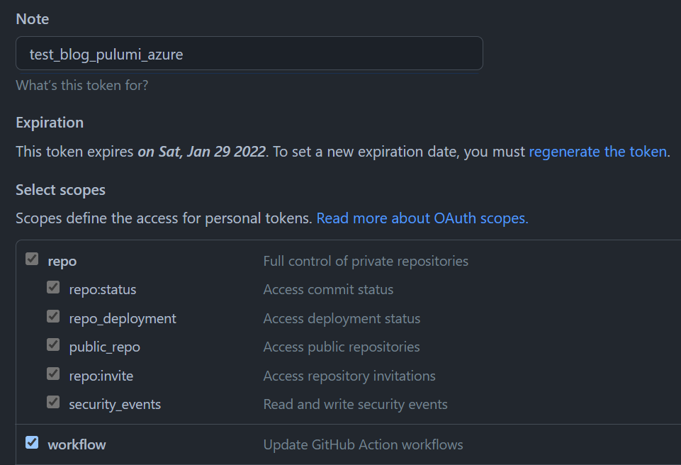
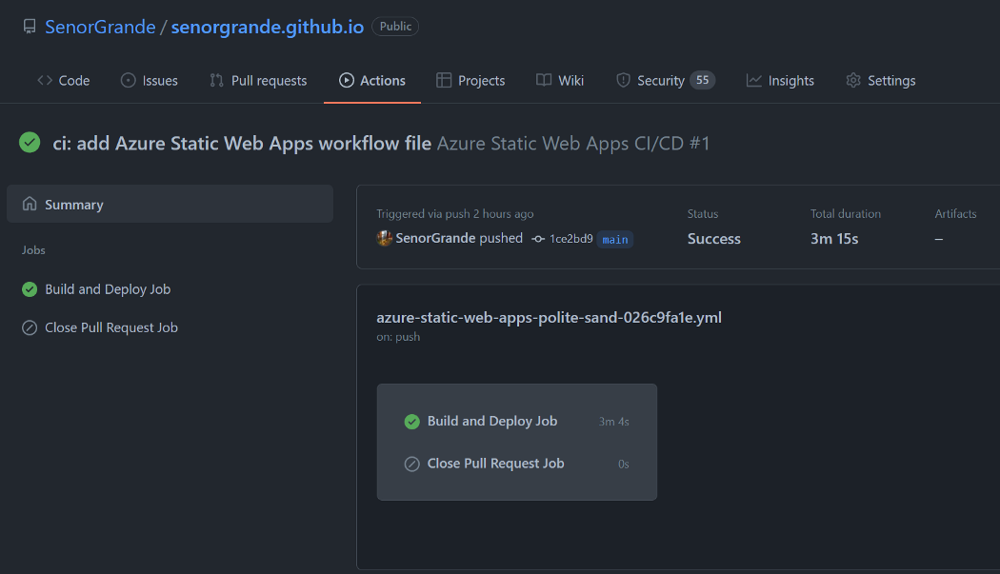

I have a Gatsby blog with GitHub Pages, now I want to deploy this to an Azure Static Web App. This should work with other frontend frameworks such as React, Angular, Vue, etc.

[Source Code](https://github.com/SenorGrande/senorgrande.github.io)

Create an `infra` folder in the project.

Run `pulumi new azure-typescript` in the `infra` directory to create a base project. (Pulumi needs an empty directory to create a project in. It’s also nice to keep the infrastructure code separate from the frontend code.)

Open the `index.ts` file and replace the contents with the following:

```
import * as pulumi from "@pulumi/pulumi";
import * as resources from "@pulumi/azure-native/resources";
import * as azure_native from "@pulumi/azure-native";

const config = new pulumi.Config();

// Create an Azure Resource Group
const resourceGroup = new resources.ResourceGroup("blog");

const staticSite = new azure_native.web.StaticSite("staticSite", {
  branch: "main",
  location: "WestUS2",
  name: "blog",
  repositoryUrl: "https://github.com/SenorGrande/senorgrande.github.io",
  repositoryToken: config.require("gh_token"),
  resourceGroupName: resourceGroup.name,
  sku: {
    name: "Free",
    tier: "Free",
  },
});

export const url = staticSite.contentDistributionEndpoint;
```

## GitHub Personal Access Token
Create a Personal Access Token in your GitHub account with the `repo` and `workflow` permissions. (Go to “Settings” > “Developer Settings” > “Personal Access Tokens”)



Set a Pulumi secret for the GitHub token just created by running the following CLI command in the Pulumi project directory, Pulumi encrypts and stores this in the Pulumi.dev.yaml file, making it safe to commit to the repo.

`$ pulumi config set --secret gh_token ghp_xxxxxxxxxxxxxxxxxxxxxxxxxxxx`

[For more info on Pulumi secrets, visit this doc.](https://www.pulumi.com/docs/intro/concepts/secrets/)

### Log in to Azure CLI
Run `az login` in the terminal to sing into your Azure account if you haven’t already. This allows Pulumi to create the resources.

### Run Pulumi
Run `pulumi up` to create the Azure Static Web App. Azure will also add a GitHub Action to your repo to continuously deploy changes to the `main` branch to the Azure SWA.



Run `pulumi destroy` to clean up all resources once you’re done.

Bonza 👌 — Hope this helped you!
