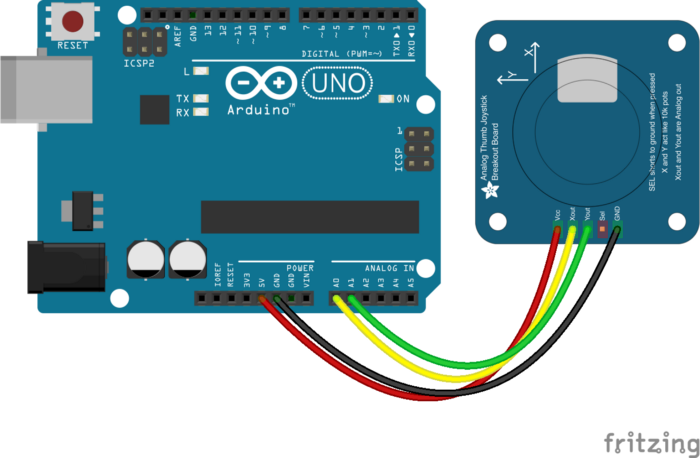

Ever wanted to control the cursor on your screen with your own joystick? No? Just me?
Follow the steps below to learn how to use NodeJS and an Arduino to control the mouse cursor on your screen.

Wire up your Arduino board to your joystick and plug it into the computer you’re developing on. There a many different kinds of joystick but most use the same principles.
[You may find this link helpful](http://johnny-five.io/api/joystick/)



Start a new project in an empty directory with `npm init`

## Install the dependencies
### Install Johnny-Five

Johnny-Five is what allows us to connect to the Arduino and get the joystick X and Y position as input.
`npm i johnny-five`

[Johnny Five GitHub Repo](https://github.com/rwaldron/johnny-five)

## Install RobotJS

Robot JS allows us to get the mouse position and move the mouse cursor to a new position by providing an X and Y value.
If on Windows:
Install Windows Build Tools in an Admin Powershell `npm --save-dev windows-build-tools`

If on Linux:
Run this command to install missing packages `sudo apt-get install libxtst-dev libpng++-dev`

Then install RobotJS
`npm i robotjs`

[RobotJS GitHub Repo](https://github.com/octalmage/robotjs)

## Code for the joystick

Create a file and call it something along the lines of `app.js` , paste the code below and run it with `node app.js` and have fun playing with your 🕹️ Bonza!

On line 3, I found that I had to include the COM port for Windows, for Linux I was able to leave `Board()` empty and it would find the Arduino automatically.

```
var robot = require("robotjs");
var five = require("johnny-five")
var board = new five.Board({port: "COM3"}); // Windows include portvar mouse;function joy_move(axis_pos, mouse_pos) {
  // Minimum threshold to count joystick movement
  var joy_min_thresh = 0.02;
  // Factor to move the mouse by
  var joy_move_factor = 10;  if (axis_pos > joy_min_thresh) {
    return(mouse_pos + joy_move_factor);
  } else if (axis_pos < -joy_min_thresh) {
    return(mouse_pos - joy_move_factor);
  } else {
    return(mouse_pos);
  }
}board.on("ready", function() {  // Create a new `joystick` hardware instance.
  var joystick = new five.Joystick({
    pins: ["A0", "A1"] // [ X, Y]
  });  joystick.on("change", function() {    mouse = robot.getMousePos();
    var new_x = joy_move(this.x, mouse.x)
    var new_y = joy_move(-this.y, mouse.y)    console.log("Mouse is at x:" + new_x + " y:" + new_y);    // Move the mouse to x, y on the screen.
    robot.moveMouse(new_x, new_y);
  });
});
```