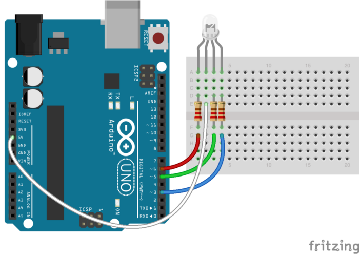
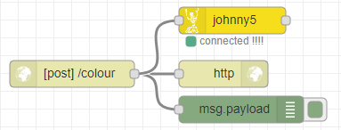

This article, I will show you how to create a Node-RED Docker container running on a Raspberry Pi. The Raspberry Pi connects to an Arduino to control and change the colour of an RGB LED, utilising the Johnny-Five framework.

Prerequisites:
- Raspberry Pi with Docker and Docker Compose installed
- Arduino with the "firmata" script installed
- An RGB LED with 330 Ohm resistors

All the code can be found at https://github.com/SenorGrande/hue-app  
Included is a React App to demonstrate sending POST requests to the Node-RED HTTP endpoint.



## Dockerfile of the Node-RED container
1. We start with a base Node-RED image that is built for devices with ARM processors
```
FROM nodered/node-red-docker:rpi
```
2. The Dockerfile copies the flows and settings files into the image
```
COPY ./flows.json /data/flows.json
COPY ./settings.js /data/settings.js
```
3. Switch to root user so we can install NPM packages
```
USER root
```
4. Install johnny-five and other packages so that we can get the Johnny-five nodes in Node-RED
```
RUN npm install johnny-five --unsafe-perm --force \
&& npm install raspi-io --unsafe-perm --force \
&& npm install node-red-contrib-gpio --unsafe-perm --force
```
5. Add the node-red user to the `dialout` group so the container can connect to the Arduino
```
RUN usermod -a -G dialout node-red
```
6. Change the user to node-red as it is not good practice for a Docker container to be running as root
```
USER node-red
```

Putting it all together...
```
FROM nodered/node-red-docker:rpi

COPY ./flows.json /data/flows.json
COPY ./settings.js /data/settings.js

USER root

RUN npm install johnny-five --unsafe-perm --force \
&& npm install raspi-io --unsafe-perm --force \
&& npm install node-red-contrib-gpio --unsafe-perm --force

RUN usermod -a -G dialout node-red

USER node-red
```

## Node-RED flow & settings
The flow consists of an HTTP endpoint node that will allow Node-RED to accept POST requests. For example, when a JSON payload contains an object such as `{colour:"#ff0000"}` (Red), the Johnny5 node will change the colour of the RGB LED to the colour specified.

The Johnny5 Node is like a function node in Node-RED. However, it is triggered when the Node-RED flow first runs, and not on input. We can overcome this by including the following in our johnny5 node:
```
node.on('input', function(msg){});
```
This function is triggered when the node receives an input. In this flow, when a POST request is received by the endpoint, the Johnny5 node will set the led colour to the hex value stored in msg.payload.colour.

## Johnny5 Node Code
```
// Initialize the RGB LED
var led = new five.LED.RGB({
  pins: {
    red: 9,
    green: 10,
    blue: 11
  }
});

// Turn it on and set the initial color
led.on();
led.color("#ffffff");

node.on('input', function(msg) {
  led.color(msg.payload.colour);
});
```

## Settings.js
In the settings.js file, allow GET requests so we don't get CORS errors when trying to POST a colour from the example React App.
```
httpNodeCors: {
  origin: "*",
  methods: "GET,PUT,POST,DELETE"
}
```

## Docker-Compose
The Docker Compose script consists of two services, the backend service is the Node-RED container and the frontend service is an Apache container that serves up the build folder of the example React app in the GitHub repo. The backend adds the Arduino Uno as a device to the customer, alter this to the address of the Arduino on the Raspberry Pi.
```
version: '3'
  services:

    backend:
      build: ./backend
      ports:
        - "1880:1880"
      devices:
        - "/dev/ttyACM0:/dev/ttyACM0"

    frontend:
      build: ./frontend
      ports:
        - "8090:80"
```

Run `docker-compose up` in the same directory as the docker-compose.yml script to build and start both services, or follow the README in the GitHub Repo on how to build and run the containers individually.

Thanks for reading.
