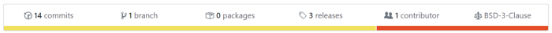

This article walks through how I created and published my Node-RED module “node-red-contrib-flatter” to NPM. Using the flat NPM package, it consists of two nodes to flatten and unflatten JavaScript objects.

https://www.npmjs.com/package/node-red-contrib-flatter

https://github.com/SenorGrande/node-red-contrib-flatter

## Starting the node

Following the Node RED documentation to create a node that converts msg.payload to lowercase, I was able to create the foundation of my package.

https://nodered.org/docs/creating-nodes/first-node

### The main differences from the starter node:

In the Node-RED documentation, you create a lower-case.js file. For my package, I created a flatter.js & unflatter.js file, one for each node.
I needed to require the “flat” NPM package, so I saved this as a dependency:
`npm i --save flat`

I can now require this in my flatter.js and unflatter.js files:
`var flatten = require('flat');`
`var unflatten = require('flat');`

And instead of this line in the example lower-case.js file:
`msg.payload = msg.payload.toLowerCase();`
I replaced it with:
`msg.payload = flatten(msg.payload);` in flatter.js, and  
`msg.payload = unflatten(msg.payload);` in unflatter.js

## Unit tests

Following the Node-RED documentation, I created a folder called “test” with a flatter_spec.js file. I only added a simple test for flattening and unflattening a payload and then checking the output matches the expected output.

Below are the dependencies I saved to my package for developing, mocha and node-red-node-test-helper. Dependencies saved to “devDependencies” with
`--save-dev` aren’t installed when someone installs your package from NPM.  
`npm i --save-dev mocha node-red node-red-node-test-helper`

## Package.json

Add “node-red” as a keyword to package.json when you are ready and it should show up on the Node-RED library flows.nodered.org within a few hours. It can then be searched in the Node-RED palette manager. Only do this when your package is ready!
Also, add other keywords that relate to your package so that it can be searched for on NPM.
```
"keywords": [
  "node-red"
],
```
Add your nodes:
```
"node-red": {    
  "nodes": {      
    "flat": "flatter.js",
    "unflat": "unflatter.js"
  }
},
```
Add a test command under scripts:
```
"scripts": {
  "test": "mocha \"test/**/*_spec.js\""
},
```
To run your unit tests, try `npm test` in the console.

## GitHub Actions

There are already many templates to choose from. I added the node.js test (which runs on every push) and node.js package actions (which runs on every release created). Personally, I removed the part that publishes to GitHub Packages.

Create an account with NPM at https://www.npmjs.com/.
Create a token under “Auth Tokens” with type “Publish”, add it as a secret to your repo with the name “npm_token”, stick it in the GitHub action as an environment variable `NODE_AUTH_TOKEN:${{secrets.npm_token}}` This should already be in the node.js package template. Create a release in GitHub, (click on “releases” in the top bar and then “Draft a new release”) voila, the GitHub Action will check that it passes the uni tests and then publish the package to NPM.



Hope this helped you out! Chur.